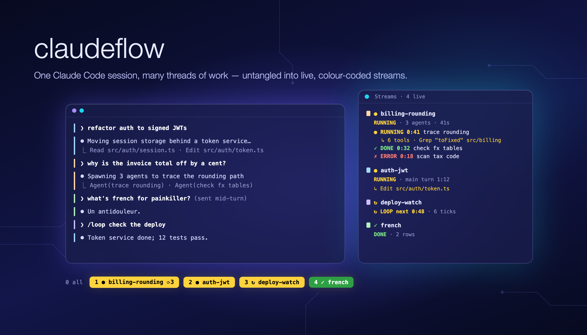

<div align="center">



[](LICENSE)


</div>

# claudeflow

A single **Claude Code** session ends up doing several things at once: a feature, a side question sent mid-turn, a `/loop` ticking away, subagents fanning out. It all lands in one transcript, interleaved.

**streams**, the mod in this repository, sorts that work into semantic streams and shows each one on its own:

- **A navigator pane** beside the transcript: every stream, its main turn and subagents with live status (yellow running, green done, red error) and what each is doing, active loops with a countdown, and recent activity.
- **A bar of pills** above the prompt, one per stream, coloured by status. Number keys jump between them.
- **A coloured line** down the left of every prompt, reply and tool row, in its stream's colour. Focus a stream and the others collapse to one-line stubs.

---

## Install

```bash
claude plugin marketplace add macleodlabs-ai/claudeflow
claude plugin install streams@claudeflow
```

Or from inside Claude Code:

```text
/plugin marketplace add macleodlabs-ai/claudeflow
/plugin install streams@claudeflow
```

New sessions load it on their own. In a session that is already running, run `/reload-plugins`.

The pane opens by itself on a terminal at least 144 columns wide in fullscreen mode; anywhere else, type `/streams`.

> **Several Claude Code accounts?** Plugins install per config directory. Run the install once in each account (for example once from each `cc-<client>` launcher if you use [claude-sessions](https://github.com/macleodlabs-ai/claude-sessions)).

### From a local checkout

To run a copy you are editing, add the folder as the marketplace instead. Claude Code reads it straight from disk, so `/reload-plugins` picks up your changes with no reinstall:

```bash
git clone https://github.com/macleodlabs-ai/claudeflow
claude plugin marketplace add ./claudeflow
claude plugin install streams@claudeflow
```

Or for a single session, without installing: `claude --plugin-dir ./claudeflow/plugins/streams`.

### Update and remove

```bash
claude plugin update streams@claudeflow
claude plugin uninstall streams@claudeflow
```

---

## Use

| To | Do |
| --- | --- |
| Open the navigator | `/streams` |
| Focus one stream | Click its name in the pane, press its pill, or `/stream <name>` |
| Show everything again | `← all streams`, the `all` pill, or `/stream off` |
| File a prompt by hand | Start it with `#name`, e.g. `#billing why is the total off?` |
| Fold a stream | Its `▾ all` button cycles all → last 10 → last 1 → header only |
| Archive or restore | `✕` beside a stream; `▸ archived (N)` lists them |
| Drive the bar from the keyboard | ctrl+x then tab, then `0` all, `1`–`9` streams, `s` the pane |
| Organise a past session | `/streams import` lists this project's sessions; `/streams import <id>` files one into streams |

Streams persist per project directory. When the mod first loads in a session, it files that session's history into streams in the background, and `/streams import` does the same for any earlier session of the project. Long histories are sorted in parallel: prompts go to Haiku in batches with several requests in flight, one pass merges the stream names the batches proposed, and a progress line at the top of the pane shows how far it has got.

---

## Configure

Settings appear in Claude Code's config menu (`/config`) under **streams**, or in `settings.json`:

```json
{
  "pluginConfigs": {
    "streams@claudeflow": {
      "options": { "diagnostics": false }
    }
  }
}
```

| Setting | Default | What it does |
| --- | --- | --- |
| `diagnostics` | `false` | Writes `debug.json` into the plugin's folder every few seconds: what the pane last drew, rows it could not place, and the last background error. Turn it on only when troubleshooting. |

**Model use.** Each new prompt is sorted into a stream with one small Haiku request. Follow-ups ("yes", "continue"), slash commands and `#tag`ged prompts need none. Filing a session's history makes one request per 25 prompts, one to merge stream names, and one per turn that had a prompt sent mid-turn.

---

## Troubleshooting

| Symptom | Fix |
| --- | --- |
| No bar above the prompt | It appears after the first prompt has been sorted. Check the mod loaded: `/plugin` should list `streams` as enabled |
| The pane does not open | Your terminal is narrower than 144 columns or not fullscreen; type `/streams` |
| A dim `streams: …` line in the transcript | Claude Code is reporting a hook that failed; the line says which and why. Please include it in an issue |
| Older rows have no coloured line | History is still being filed; it finishes within a minute or two on a long session |

---

## License

Proprietary. © 2026 Macleod Labs, https://macleodlabs.ai. See [LICENSE](LICENSE).
