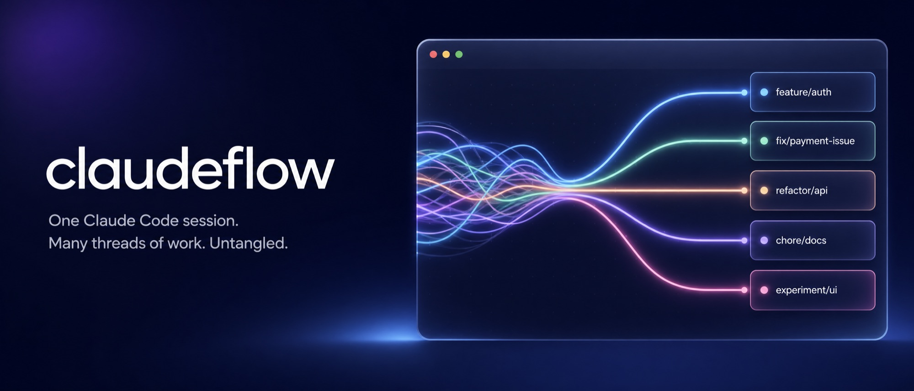
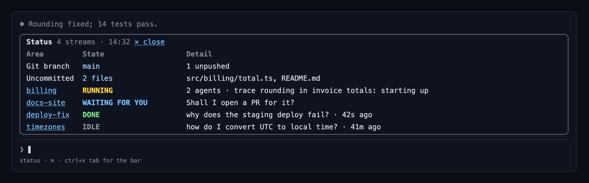

<div align="center">



<h1>claudeflow</h1>

<p>
  <a href="LICENSE"></a>
  <a href="https://github.com/macleodlabs-ai/claudeflow/releases"></a>
  
  
</p>
<p>
  <a href="#-install"></a>
</p>
<p>
  <a href="#-install"></a>
  <a href="https://github.com/macleodlabs-ai/claudeflow/stargazers"></a>
  <a href="https://github.com/macleodlabs-ai/claudeflow/network/members"></a>
  <a href="https://github.com/macleodlabs-ai/claudeflow/watchers"></a>
</p>
<p>
  
  
  
  
  <a href="https://github.com/macleodlabs-ai/claudeflow/issues"></a>
  <a href="https://github.com/macleodlabs-ai/claudeflow/commits/main"></a>
  <a href="https://macleodlabs.ai"></a>
</p>
<p>
  <a href="https://macleodlabs.ai/?utm_source=github&utm_medium=readme&utm_campaign=claudeflow"></a>
</p>

<p>
  <a href="#-install">Install</a> ·
  <a href="#-what-you-get">What you get</a> ·
  <a href="#-use">Use</a> ·
  <a href="#%EF%B8%8F-configure">Configure</a> ·
  <a href="#-troubleshooting">Troubleshooting</a> ·
  <a href="#-work-with-macleod-labs"><b>Hire us</b></a>
</p>

</div>

---

A real Claude Code session is never one task. You start a feature, ask a side question mid-turn, leave a `/loop` watching a deploy, and fan out three subagents to chase a bug. It all lands in **one transcript**, interleaved.

**streams**, the mod in this repository, sorts that work into **semantic streams** as it happens, and gives each one its own colour, status and history.


## ✨ What you get

<table>
<tr>
<td width="33%" valign="top">

### 🧭 Navigator pane
Every stream beside the transcript: its main turn and subagents with **live status**, what each is doing right now, elapsed time, tool count, and loop countdowns.

</td>
<td width="33%" valign="top">

### 💊 Pill bar
One pill per stream above the prompt, coloured by health. **Number keys** jump between them; `0` shows everything.

</td>
<td width="33%" valign="top">

### 🎨 Stream stripes
A thin pastel line down the left of every prompt, reply and tool row. **Focus** a stream and the rest fold to one-line stubs.

</td>
</tr>
<tr>
<td valign="top">

### 🧠 Semantic routing
Structure first (subagents, loops, follow-ups, `#tags` with autocomplete), then one small **Haiku** call for anything new. Prompts sent mid-turn go to the right stream.

</td>
<td valign="top">

### 🗂️ History, in parallel
Existing sessions are filed into streams in the background, with batched, **parallel** classification and a live progress line.

</td>
<td valign="top">

### 📦 Archive & fold
Hide finished streams with `✕` and bring them back later. Fold any stream to its last 10 rows, last row, or header. Idle streams fold themselves.

</td>
</tr>
</table>

### 📋 Status card

Type `status`, or press `status` in the bar, and a card opens above the prompt with every piece of work in the session and where it stands. It is answered locally, so it costs no model call and works while a turn is running.



- **What needs you comes first**: running work, then loops, then streams **waiting for you** (their last reply ended on a question, shown as the detail), then failures, then finished work.
- **Git rows on top**: the branch, whether anything is unpushed, and which files are uncommitted.
- **Click a stream's name** to open it in the pane. `✕ close` or your next prompt hides the card.

### Status at a glance

| Colour | Status | Meaning |
| :---: | --- | --- |
| 🟨 | **RUNNING** | A turn, subagent or loop is working now |
| 🟩 | **DONE** | Finished cleanly |
| 🟦 | **WAITING FOR YOU** | On the status card: the stream's last reply asked you something |
| 🟥 | **ERROR** | A subagent or turn failed |
| 🟧 | **STALLED** | No activity for longer than expected |
| ↻ | **LOOP** | A `/loop` or cron is armed, with a countdown to the next tick. A loop that stops, or lapses 10 minutes without re-arming, drops back to its stream's status |

---

## 🚀 Install

```bash
claude plugin marketplace add macleodlabs-ai/claudeflow
claude plugin install streams@claudeflow
```

<details>
<summary><b>From inside Claude Code</b></summary>

```text
/plugin marketplace add macleodlabs-ai/claudeflow
/plugin install streams@claudeflow
```

</details>

New sessions load it automatically; in a running session, run `/reload-plugins`. The pane opens by itself in fullscreen terminals at least **144 columns** wide. Anywhere else, type `/streams`.

> [!TIP]
> **Several Claude Code accounts?** Plugins install per account, so sign in to each one and run the install there (or, if you use [claude-sessions](https://github.com/macleodlabs-ai/claude-sessions), once from each `cc-<client>` launcher).

<details>
<summary><b>From a local checkout</b> (live edits, no reinstall)</summary>

Add the folder as the marketplace. Claude Code reads it straight from disk, so `/reload-plugins` picks up your changes:

```bash
git clone https://github.com/macleodlabs-ai/claudeflow
claude plugin marketplace add ./claudeflow
claude plugin install streams@claudeflow
```

Or for one session only, without installing:

```bash
claude --plugin-dir ./claudeflow/plugins/streams
```

</details>

### Update or remove

| Action | Command |
| --- | --- |
| Update | `claude plugin update streams@claudeflow` |
| Uninstall | `claude plugin uninstall streams@claudeflow` |

---

## 🎛 Use

### Commands

| Command | What it does |
| --- | --- |
| `status` or `status?` | Show the status card above the prompt: every stream's state (running, loop, waiting for you, done) and what it is doing, plus git branch and uncommitted files. Answered locally: no model call, works mid-turn |
| `/streams` | Open the navigator pane |
| `/streams status` | Same as typing `status` |
| `/streams update` | Update to the latest release and reload it into this session, no restart |
| `/stream <name>` | Focus one stream; others fold to stubs |
| `/stream off` | Show every stream again |
| `/stream move <name>` | Refile the last prompt, and everything after it, under another stream (created if new) when it was sorted wrongly |
| `/stream` | List streams with their summaries |
| `/streams import` | List this project's past sessions |
| `/streams import <id>` | File a past session into streams (re-importing replaces, never duplicates) |

### In the pane and bar

| To | Do |
| --- | --- |
| See the status of all work | Press `status` in the bar (<kbd>t</kbd> when the bar has focus), or type `status`. Click a stream's name on the card to open it; `✕ close` or your next prompt hides it |
| Focus a stream | Click its name in the pane, or press its pill |
| Show everything | `← all streams`, or the `all` pill |
| File a prompt by hand | Start it with `#name`, e.g. `#billing why is the total off?` Type `#` and the bar lists matching streams; <kbd>tab</kbd> completes the first |
| Fold a stream | `▾ all` cycles **all → last 10 → last 1 → header only** |
| Archive or restore | `✕` beside a stream; `▸ archived (N)` lists them |
| Collapse everything | `collapse all` / `expand all` at the top of the pane |
| Switch a stream's chat view | The stream header shows `view ◉ full ○ compact`: full draws the chat as the session does, with markdown, syntax-highlighted code and diffs; compact is one line per row. Click either, or press <kbd>v</kbd> in the pane |

### Keyboard

| Keys | Action |
| --- | --- |
| <kbd>ctrl</kbd>+<kbd>x</kbd> then <kbd>tab</kbd> | Move focus to the pill bar |
| <kbd>0</kbd> | All streams |
| <kbd>1</kbd>–<kbd>9</kbd> | Jump to stream *n* |
| <kbd>s</kbd> | Open the pane |

Streams persist **per project directory**, across sessions.

---

## ⚙️ Configure

Settings live in `/config` under **streams**, or in `settings.json`:

```json
{
  "pluginConfigs": {
    "streams@claudeflow": {
      "options": { "chatStyle": "full", "diagnostics": false }
    }
  }
}
```

| Setting | Default | Description |
| --- | :---: | --- |
| `chatStyle` | `full` | How a stream's own view draws its chat: `full`, as the session draws it, with markdown, syntax-highlighted commands and file contents, and edits as coloured diffs; or `compact`, one line per row. The `view` switch in a stream's header changes it for the session. |
| `diagnostics` | `false` | Writes `debug.json` into the plugin folder every few seconds: what the pane last drew, rows it could not place, and the last background error. Turn on only when troubleshooting. |

### Model use

| Event | Haiku requests |
| --- | --- |
| New prompt | 1 |
| Follow-up (`yes`, `continue`), slash command, `#tag`ged prompt | 0 |
| Filing history | 1 per 25 prompts, plus 1 merge pass, plus 1 per turn that had a mid-turn prompt |

---

## 🩺 Troubleshooting

| Symptom | Fix |
| --- | --- |
| No pill bar | It appears once the first prompt is sorted. Check `/plugin` lists **streams** as enabled. |
| Pane doesn't open | The terminal is under 144 columns or not fullscreen. Type `/streams`. |
| Dim `streams: …` line in the transcript | Claude Code is reporting a failed hook; the line names it. Include it in an issue. |
| Older rows have no stripe | History is still filing; watch the progress line at the top of the pane. |

---

## 🤝 Work with Macleod Labs

<table>
<tr>
<td>

**claudeflow is built by [Macleod Labs](https://macleodlabs.ai).** We build Claude Code mods, agent workflows and AI tooling for engineering teams: custom plugins, multi-agent pipelines, and getting your team productive with Claude Code.

<a href="https://macleodlabs.ai/?utm_source=github&utm_medium=readme&utm_campaign=claudeflow"></a>

</td>
</tr>
</table>

---

<div align="center">

**Proprietary** · © 2026 [Macleod Labs](https://macleodlabs.ai) · See [LICENSE](LICENSE)

</div>
