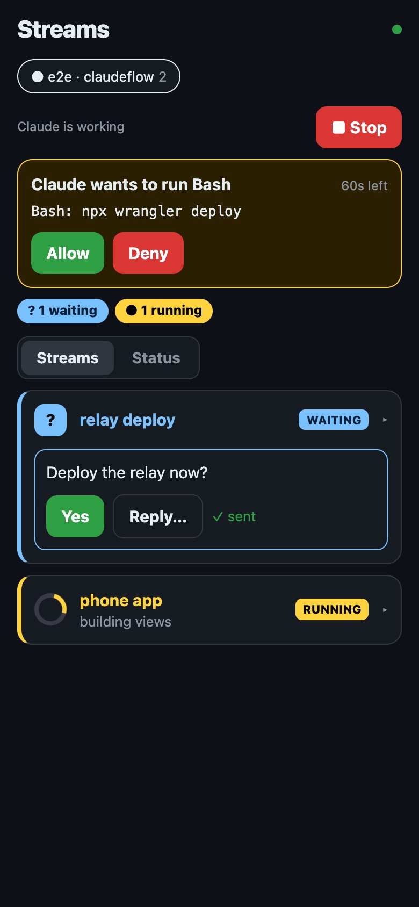

<div align="center">


<h1>claudeflow</h1>

<p>
  <a href="LICENSE"></a>
  <a href="https://github.com/macleodlabs-ai/claudeflow/releases"></a>
  
  
</p>
<p>
  <a href="#-install"></a>
</p>
<p>
  <a href="#-install"></a>
  <a href="https://github.com/macleodlabs-ai/claudeflow/stargazers"></a>
  <a href="https://github.com/macleodlabs-ai/claudeflow/network/members"></a>
  <a href="https://github.com/macleodlabs-ai/claudeflow/watchers"></a>
</p>
<p>
  
  
  
  
  <a href="https://github.com/macleodlabs-ai/claudeflow/issues"></a>
  <a href="https://github.com/macleodlabs-ai/claudeflow/commits/main"></a>
  <a href="https://macleodlabs.ai"></a>
</p>
<p>
  <a href="https://macleodlabs.ai/?utm_source=github&utm_medium=readme&utm_campaign=claudeflow"></a>
</p>

<p>
  <a href="#-install">Install</a> ·
  <a href="#-what-you-get">What you get</a> ·
  <a href="#-use">Use</a> ·
  <a href="#%EF%B8%8F-configure">Configure</a> ·
  <a href="#-troubleshooting">Troubleshooting</a> ·
  <a href="#-work-with-macleod-labs"><b>Hire us</b></a>
</p>

</div>

---

A real Claude Code session is never one task. You start a feature, ask a side question mid-turn, leave a `/loop` watching a deploy, and fan out three subagents to chase a bug. It all lands in **one transcript**, interleaved.

**streams**, the mod in this repository, sorts that work into **semantic streams** as it happens, and gives each one its own colour, status and history.


## ✨ What you get

<table>
<tr>
<td width="33%" valign="top">

### 🧭 Navigator pane
Every stream beside the transcript: its main turn and subagents with **live status**, what each is doing right now, elapsed time, tool count, and loop countdowns.

</td>
<td width="33%" valign="top">

### 💊 Pill bar
One pill per stream above the prompt, coloured by health. **Number keys** jump between them; `0` shows everything.

</td>
<td width="33%" valign="top">

### 🎨 Stream stripes
A thin pastel line down the left of every prompt, reply and tool row. **Focus** a stream and the rest fold to one-line stubs.

</td>
</tr>
<tr>
<td valign="top">

### 🧠 Semantic routing
Structure first (subagents, loops, follow-ups, `#tags` with autocomplete), then one small **Haiku** call for anything new. Prompts sent mid-turn go to the right stream.

</td>
<td valign="top">

### 🗂️ History, in parallel
Existing sessions are filed into streams in the background, with batched, **parallel** classification and a live progress line.

</td>
<td valign="top">

### 📦 Archive & fold
Hide finished streams with `✕` and bring them back later. Fold any stream to its last 10 rows, last row, or header. Idle streams fold themselves.

</td>
</tr>
</table>

### 📋 Status card

Type `status`, or press `status` in the bar, and a card opens above the prompt with every piece of work in the session and where it stands. It is answered locally, so it costs no model call and works while a turn is running.


- **What needs you comes first**: running work, then loops, then streams **waiting for you** (their last reply ended on a question, shown as the detail), then failures, then finished work.
- **Git rows on top**: the branch, whether anything is unpushed, and which files are uncommitted.
- **Tickets**: any ticket id you name in a prompt or an agent's task (`TL-260`, `ENG-1042`) gets its own row: running agents on it say what they are doing and how long they have been quiet; otherwise its latest news, or that its agent failed.
- **Plan limits at the bottom**: each window (5-hour, week) as a bar and percent, green, then yellow from 50%, red from 80%, with how long until it resets and the weekday and time it does.
- **Click a stream's name** to open it in the pane. `✕ close` (top right) or your next prompt hides the card.
- **Scroll a long card** with the wheel, or press <kbd>ctrl</kbd>+<kbd>x</kbd> <kbd>tab</kbd> to move focus to it: then <kbd>↑</kbd> <kbd>↓</kbd> scroll and <kbd>q</kbd> closes it, without touching Claude's turn.
- **On your phone or tablet** the app's **Status** switch shows the same card.

### 📱 On your phone and tablet

Claude Code's Remote Control does not draw plugin UI in the phone app, so streams brings its own: the **Claudeflow app**, a web page you add to your Home Screen. Any number of phones and tablets can use it at once, and each one sees every running session of every Claude Code account it has paired with.

<p align="center"></p>

- **Every session, one page:** a tab per running session (`macleod · claudeflow`). A session that goes quiet greys out, then leaves.
- **What needs you first:** a waiting stream's question shows on its card without opening it.
- **Tap a card** for its agents (what each is doing, tool count, time) and its latest prompts and replies.
- **Streams | Status:** switch to the status card, as on the terminal: git, tickets, then every stream and what it is doing.
- **Plan usage, pinned to the bottom:** one row with each limit's bar and percent; tap it for when each resets.
- **Answer from the phone:** **Yes** on a waiting question, or **Reply…** with your own words. What you send is filed in that stream.
- **Stop** a running turn (tap twice, so a stray touch doesn't).
- **Allow or deny permission prompts.** While the app is open and unlocked on a device, a prompt goes there first, with what the call would do (`Bash: git push …`). **Allow** asks for Face ID (or your passcode) first. Unanswered after 60 seconds, or with no device looking, the prompt appears on the Mac as usual.

#### How it connects

Nothing runs on your Mac beyond the plugin, and nothing on your Mac listens for connections. Each Claude Code session posts to a small **relay** on Cloudflare's free plan; each phone or tablet keeps one WebSocket open to the same relay. The relay passes sealed messages between them and serves the app itself.

```
Claude Code sessions ──HTTPS──► relay (Cloudflare Worker + Durable Object) ◄──WebSocket── phones, tablets
```

#### Set up (about 5 minutes, once)

**1. Install the plugin** (see [Install](#-install)).

**2. Get a relay.** Use a hosted relay if someone runs one for you, or deploy your own to your Cloudflare account. The free plan is enough. You need [Node](https://nodejs.org) 22 or later and [Bun](https://bun.sh) on the Mac you deploy from:

```bash
git clone https://github.com/macleodlabs-ai/claudeflow
cd claudeflow/relay/cloudflare
npx wrangler login            # once: signs this Mac in to your Cloudflare account
npm ci && ../../app/build.sh && npx wrangler deploy
```

`wrangler deploy` prints your relay's address, for example `https://claudeflow-relay.<you>.workers.dev`. Run the last line again after you update the checkout.

**3. Tell streams where the relay is.** In `/config` → **streams** → **Relay address**, or in `settings.json`:

```json
{ "pluginConfigs": { "streams@claudeflow": { "options": { "relayUrl": "https://claudeflow-relay.<you>.workers.dev" } } } }
```

Then `/reload-plugins` in running sessions.

**4. Run `/streams phone`.** It opens a **Pair** page in your Mac's browser with a QR code. The code works for 10 minutes, for as many devices as you scan it with.

**5. Scan it with each phone or tablet.** The app opens in Safari (or Chrome on Android). Tap **Create passkey**: the device makes a passkey for the relay's address, saved with Face ID or your passcode. Then **Share → Add to Home Screen** so it opens like an app.

From then on, each time the app connects it shows **Locked**: tap **Unlock** and Face ID opens it. One unlock covers every session of that account.

**Several accounts?** Set the same `relayUrl` in each one and run `/streams phone` from each. A device can pair with all of them; each account is its own room on the relay, and the app shows the sessions of all of them side by side.

**Manage devices:** `/streams phone devices` lists the paired ones, `/streams phone forget <id>` removes one (`forget all` removes every one). A forgotten device has to scan a new code.

<details>
<summary><b>What the relay can and cannot see</b></summary>

The relay is a Cloudflare Worker with one Durable Object per account (a "room"). It routes frames; it holds no keys.

**It can see:** the room id, device ids and session ids; when each device connects and whether it is on screen; the size and timing of every message; the SHA-256 of the account's relay token; and the public values in a device's hello (its public keys, its passkey's public key, and passkey signatures).

**It cannot:**
- **read** snapshots, answers, permission decisions or anything else after the hello. Each session and device seal every message with XChaCha20-Poly1305 under keys from X25519 (fresh ephemeral keys mixed with the long-term ones) and HKDF-SHA256.
- **change or replay** a message. Each sealed message carries a counter; anything altered, repeated or reordered is dropped.
- **pair a device of its own.** Pairing needs the QR code's secret, which travels after the `#` in the link, and browsers never send that part to any server, the relay included.
- **pose as your Mac.** The device checks the session's long-term key from the QR code; a relay that swaps in its own key derives different keys and can open nothing.
- **approve anything.** Your Mac keeps each device's passkey public key and checks every unlock and every **Allow** itself, against a fresh challenge and Face ID.

**It can still** drop or delay messages, as any network can. Then the prompt falls back to the Mac after 60 seconds.

Session to relay traffic is budgeted for the free plan (100,000 requests a day): a session posts when its snapshot changes and every 30 seconds otherwise, every 2 seconds only while a device is looking, and not at all while the account has no paired device and no open pairing. Code blocks stay on the Mac; prompts and replies are cut to a few hundred characters before sealing.

</details>

### 🔄 Updates without a restart

Once a session starts, and every six hours after, streams checks every plugin you have installed against its marketplace. When one has a newer release, an **⬆ update** button appears in the bar and the pane, and a toast says so. Pressing it (or <kbd>u</kbd>, or `/streams update`) installs the updates on your Mac and reloads plugins into the running session: no restart.

### Status at a glance

| Colour | Status | Meaning |
| :---: | --- | --- |
| 🟨 | **RUNNING** | A turn, subagent or loop is working now |
| 🟩 | **DONE** | Finished cleanly |
| 🟦 | **WAITING FOR YOU** | On the status card: the stream's last reply asked you something |
| 🟥 | **ERROR** | A subagent or turn failed |
| 🟧 | **STALLED** | No activity for longer than expected |
| ↻ | **LOOP** | A `/loop` or cron is armed, with a countdown to the next tick. A loop that stops, or lapses 10 minutes without re-arming, drops back to its stream's status |

---

## 🚀 Install

```bash
claude plugin marketplace add macleodlabs-ai/claudeflow
claude plugin install streams@claudeflow
```

<details>
<summary><b>From inside Claude Code</b></summary>

```text
/plugin marketplace add macleodlabs-ai/claudeflow
/plugin install streams@claudeflow
```

</details>

New sessions load it automatically; in a running session, run `/reload-plugins`. The pane opens by itself in fullscreen terminals at least **144 columns** wide. Anywhere else, type `/streams`.

> [!TIP]
> **Several Claude Code accounts?** Plugins install per account, so sign in to each one and run the install there (or, if you use [claude-sessions](https://github.com/macleodlabs-ai/claude-sessions), once from each `cc-<client>` launcher).

<details>
<summary><b>From a local checkout</b> (live edits, no reinstall)</summary>

Add the folder as the marketplace. Claude Code reads it straight from disk, so `/reload-plugins` picks up your changes:

```bash
git clone https://github.com/macleodlabs-ai/claudeflow
claude plugin marketplace add ./claudeflow
claude plugin install streams@claudeflow
```

Or for one session only, without installing:

```bash
claude --plugin-dir ./claudeflow/plugins/streams
```

</details>

**Want streams on your phone or tablet?** Follow [Set up](#set-up-about-5-minutes-once) after installing: a relay, `relayUrl`, then `/streams phone`.

### Update or remove

| Action | Command |
| --- | --- |
| Update | `claude plugin update streams@claudeflow` |
| Uninstall | `claude plugin uninstall streams@claudeflow` |

---

## 🎛 Use

### Commands

| Command | What it does |
| --- | --- |
| `status` or `status?` | Show the status card above the prompt: every stream's state (running, loop, waiting for you, done) and what it is doing, plus git branch and uncommitted files. Answered locally: no model call, works mid-turn |
| `/streams` | Open the navigator pane |
| `/streams status` | Same as typing `status` |
| `/streams phone` | Open the pairing page with a QR code for your phones and tablets (needs `relayUrl`; see [On your phone and tablet](#-on-your-phone-and-tablet)) |
| `/streams phone devices` | List the paired phones and tablets |
| `/streams phone forget <id>` | Unpair one device (`all` unpairs every one) |
| `/streams update` | Check every installed plugin for a newer release, install them, and reload plugins into this session, no restart |
| `/stream <name>` | Focus one stream; others fold to stubs |
| `/stream off` | Show every stream again |
| `/stream move <name>` | Refile the last prompt, and everything after it, under another stream (created if new) when it was sorted wrongly |
| `/stream` | List streams with their summaries |
| `/streams import` | List this project's past sessions |
| `/streams import <id>` | File a past session into streams (re-importing replaces, never duplicates) |

### In the pane and bar

| To | Do |
| --- | --- |
| See the status of all work | Press `status` in the bar (<kbd>t</kbd> when the bar has focus), or type `status`. Click a stream's name on the card to open it; `✕ close` or your next prompt hides it |
| Focus a stream | Click its name in the pane, or press its pill |
| Show everything | `← all streams`, or the `all` pill |
| File a prompt by hand | Start it with `#name`, e.g. `#billing why is the total off?` Type `#` and the bar lists matching streams; <kbd>tab</kbd> completes the first |
| Fold a stream | `▾ all` cycles **all → last 10 → last 1 → header only** |
| Archive or restore | `✕` beside a stream; `▸ archived (N)` lists them |
| Collapse everything | `collapse all` / `expand all` at the top of the pane |
| Fold the pane away | `⇥ hide` (<kbd>h</kbd>) folds the docked pane to a `◂ streams` tab at the right of the bar; the tab (<kbd>s</kbd>) brings it back at the width it had. It stays folded in new sessions until you open it |
| Switch a stream's chat view | The stream header shows `view ◉ full ○ compact`: full draws the chat as the session does, with markdown, syntax-highlighted code and diffs; compact is one line per row. Click either, or press <kbd>v</kbd> in the pane |

### Keyboard

| Keys | Action |
| --- | --- |
| <kbd>ctrl</kbd>+<kbd>x</kbd> then <kbd>tab</kbd> | Move focus to the pill bar |
| <kbd>0</kbd> | All streams |
| <kbd>1</kbd>–<kbd>9</kbd> | Jump to stream *n* |
| <kbd>s</kbd> | Open the pane |

Streams persist **per project directory**, across sessions.

---

## ⚙️ Configure

Settings live in `/config` under **streams**, or in `settings.json`:

```json
{
  "pluginConfigs": {
    "streams@claudeflow": {
      "options": { "chatStyle": "full", "diagnostics": false, "relayUrl": "" }
    }
  }
}
```

| Setting | Default | Description |
| --- | :---: | --- |
| `chatStyle` | `full` | How a stream's own view draws its chat: `full`, as the session draws it, with markdown, syntax-highlighted commands and file contents, and edits as coloured diffs; or `compact`, one line per row. The `view` switch in a stream's header changes it for the session. |
| `diagnostics` | `false` | Writes `debug.json` into the plugin folder every few seconds: what the pane last drew, rows it could not place, and the last background error. Turn on only when troubleshooting. |
| `relayUrl` | empty | The relay your phones and tablets connect through, e.g. `https://claudeflow-relay.<you>.workers.dev`. Empty: no remote, and sessions never call any relay. |

### Model use

| Event | Haiku requests |
| --- | --- |
| New prompt | 1 |
| Follow-up (`yes`, `continue`), slash command, `#tag`ged prompt | 0 |
| Filing history | 1 per 25 prompts, plus 1 merge pass, plus 1 per turn that had a mid-turn prompt |

---

## 🧪 Develop

| Part | Where | Check |
| --- | --- | --- |
| The streams plugin, and the session's side of the remote | `plugins/streams` | `claude plugin test .` (115 tests) and `claude plugin validate --strict .` |
| The relay | `relay/cloudflare` | `npm ci`, then `npm run typecheck` and `bun test` (9 tests against a real `wrangler dev`) |
| The phone and tablet app | `app` | `bun test` (21 tests) and `npm run typecheck`; `./build.sh` writes the app into `relay/cloudflare/public` |
| Everything together | `e2e/run.ts` | `app/build.sh`, then `bun e2e/run.ts` from the repo root (12 checks) |

`e2e/run.ts` runs the whole path on your Mac with no Cloudflare account. It starts `wrangler dev`, plays a Claude Code session with the plugin's own remote code, and drives two headless Chrome devices with virtual passkeys through pairing, unlocking, answering and allowing. A third device with a made-up pairing secret must be refused. Screenshots go to `e2e/shots/`. wrangler needs Node 22 or later on `PATH`. [ARCHITECTURE.md](ARCHITECTURE.md) describes the protocol.

---

## 🩺 Troubleshooting

| Symptom | Fix |
| --- | --- |
| No pill bar | It appears once the first prompt is sorted. Check `/plugin` lists **streams** as enabled. |
| Pane doesn't open | The terminal is under 144 columns or not fullscreen. Type `/streams`. |
| Dim `streams: …` line in the transcript | Claude Code is reporting a failed hook; the line names it. Include it in an issue. |
| Older rows have no stripe | History is still filing; watch the progress line at the top of the pane. |
| The app says **Connecting…** | Check the relay address loads in the phone's browser. If you deployed your own, run `npx wrangler deploy` again from `relay/cloudflare`. |
| `/streams phone` says to set the relay address | Set `relayUrl` (see [Set up](#set-up-about-5-minutes-once)), then `/reload-plugins`. |
| **Not paired** with *pairing expired* or *bad pairing proof* | The QR code is older than 10 minutes, or from another `/streams phone`. Run `/streams phone` and scan the new code. |
| **Locked** with *passkey not verified* | The device was forgotten, or its passkey was made for another relay address. Run `/streams phone` and pair it again. |
| A session is missing on the phone | That session runs an older streams, or another account with no device paired: update the plugin and `/reload-plugins`, or run `/streams phone` in that account. |

---

## 🤝 Work with Macleod Labs

<table>
<tr>
<td>

**claudeflow is built by [Macleod Labs](https://macleodlabs.ai).** We build Claude Code mods, agent workflows and AI tooling for engineering teams: custom plugins, multi-agent pipelines, and getting your team productive with Claude Code.

<a href="https://macleodlabs.ai/?utm_source=github&utm_medium=readme&utm_campaign=claudeflow"></a>

</td>
</tr>
</table>

---

<div align="center">

**Proprietary** · © 2026 [Macleod Labs](https://macleodlabs.ai) · See [LICENSE](LICENSE)

</div>
