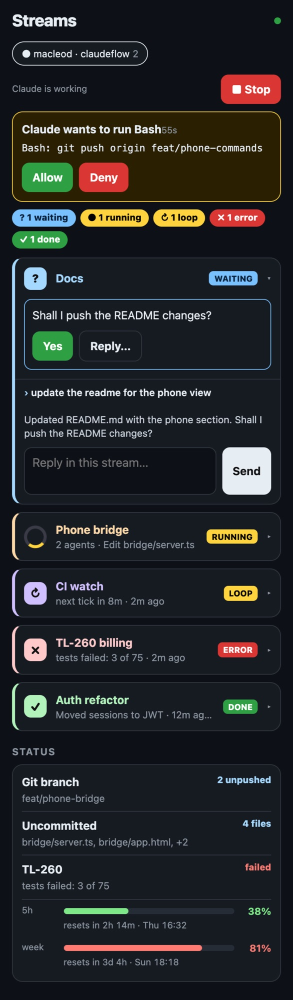
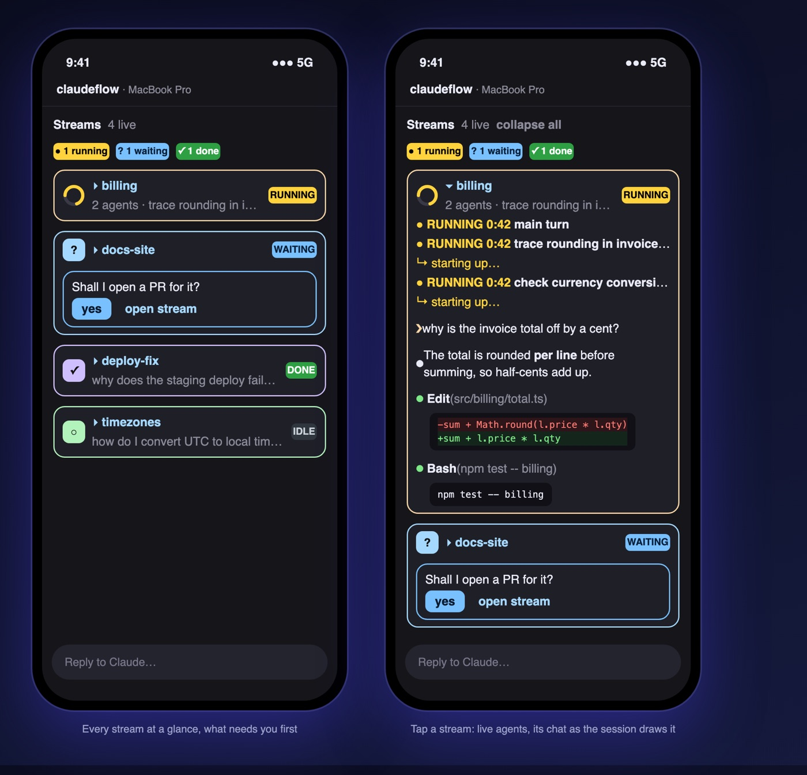

<div align="center">


<h1>claudeflow</h1>

<p>
  <a href="LICENSE"></a>
  <a href="https://github.com/macleodlabs-ai/claudeflow/releases"></a>
  
  
</p>
<p>
  <a href="#-install"></a>
</p>
<p>
  <a href="#-install"></a>
  <a href="https://github.com/macleodlabs-ai/claudeflow/stargazers"></a>
  <a href="https://github.com/macleodlabs-ai/claudeflow/network/members"></a>
  <a href="https://github.com/macleodlabs-ai/claudeflow/watchers"></a>
</p>
<p>
  
  
  
  
  <a href="https://github.com/macleodlabs-ai/claudeflow/issues"></a>
  <a href="https://github.com/macleodlabs-ai/claudeflow/commits/main"></a>
  <a href="https://macleodlabs.ai"></a>
</p>
<p>
  <a href="https://macleodlabs.ai/?utm_source=github&utm_medium=readme&utm_campaign=claudeflow"></a>
</p>

<p>
  <a href="#-install">Install</a> ·
  <a href="#-what-you-get">What you get</a> ·
  <a href="#-use">Use</a> ·
  <a href="#%EF%B8%8F-configure">Configure</a> ·
  <a href="#-troubleshooting">Troubleshooting</a> ·
  <a href="#-work-with-macleod-labs"><b>Hire us</b></a>
</p>

</div>

---

A real Claude Code session is never one task. You start a feature, ask a side question mid-turn, leave a `/loop` watching a deploy, and fan out three subagents to chase a bug. It all lands in **one transcript**, interleaved.

**streams**, the mod in this repository, sorts that work into **semantic streams** as it happens, and gives each one its own colour, status and history.


## ✨ What you get

<table>
<tr>
<td width="33%" valign="top">

### 🧭 Navigator pane
Every stream beside the transcript: its main turn and subagents with **live status**, what each is doing right now, elapsed time, tool count, and loop countdowns.

</td>
<td width="33%" valign="top">

### 💊 Pill bar
One pill per stream above the prompt, coloured by health. **Number keys** jump between them; `0` shows everything.

</td>
<td width="33%" valign="top">

### 🎨 Stream stripes
A thin pastel line down the left of every prompt, reply and tool row. **Focus** a stream and the rest fold to one-line stubs.

</td>
</tr>
<tr>
<td valign="top">

### 🧠 Semantic routing
Structure first (subagents, loops, follow-ups, `#tags` with autocomplete), then one small **Haiku** call for anything new. Prompts sent mid-turn go to the right stream.

</td>
<td valign="top">

### 🗂️ History, in parallel
Existing sessions are filed into streams in the background, with batched, **parallel** classification and a live progress line.

</td>
<td valign="top">

### 📦 Archive & fold
Hide finished streams with `✕` and bring them back later. Fold any stream to its last 10 rows, last row, or header. Idle streams fold themselves.

</td>
</tr>
</table>

### 📋 Status card

Type `status`, or press `status` in the bar, and a card opens above the prompt with every piece of work in the session and where it stands. It is answered locally, so it costs no model call and works while a turn is running.


- **What needs you comes first**: running work, then loops, then streams **waiting for you** (their last reply ended on a question, shown as the detail), then failures, then finished work.
- **Git rows on top**: the branch, whether anything is unpushed, and which files are uncommitted.
- **Tickets**: any ticket id you name in a prompt or an agent's task (`TL-260`, `ENG-1042`) gets its own row: running agents on it say what they are doing and how long they have been quiet; otherwise its latest news, or that its agent failed.
- **Plan limits at the bottom**: each window (5-hour, week) as a bar and percent, green, then yellow from 50%, red from 80%, with how long until it resets and the weekday and time it does.
- **Click a stream's name** to open it in the pane. `✕ close` (top right) or your next prompt hides the card.
- **Scroll a long card** with the wheel, or press <kbd>ctrl</kbd>+<kbd>x</kbd> <kbd>tab</kbd> to move focus to it: then <kbd>↑</kbd> <kbd>↓</kbd> scroll and <kbd>q</kbd> closes it, without touching Claude's turn.
- **On your phone** the card opens at the top of the streams accordion (its `status` button, or type `status`) and scrolls by touch.

### 📱 On your phone

Claude Code's Remote Control does not draw plugin UI in the phone app yet, so streams brings its own: the **phone bridge**, a small server on your Mac that every session reports to and that serves your phone a live page of all of them.

<p align="center"></p>

- **Every session, one page:** a tab per running session (`macleod · claudeflow`), the busiest first. A session that stops reporting greys out, then leaves.
- **What needs you first:** a waiting stream's question shows on its card without opening it.
- **Tap a card** for its agents (what each is doing, tool count, time) and its latest prompts and replies.
- **Streams | Status:** switch to the status card, as on the terminal: git, tickets, then every stream and what it is doing.
- **Plan usage, pinned to the bottom:** one row with each limit's bar and percent; tap it for when each resets.
- **Answer from the phone:** **Yes** on a waiting question, or **Reply…** with your own words. Every opened card has a reply box; what you send is filed in that stream.
- **Stop** a running turn (tap twice, so a stray touch doesn't).
- **Allow or deny permission prompts.** While the Streams page is open on your phone, a prompt goes there first, with what the call would do (`Bash: git push …`). Unanswered after 60 seconds, or with no phone looking, it appears on the Mac as usual.

#### Set up your phone (about 10 minutes, once)

Your phone reaches your Mac over **[Tailscale](https://tailscale.com)**, a free private network between your own devices. Nothing is opened to the internet: only devices signed in to your Tailscale account can load the page, and each one also needs a pairing code from your Mac.

**What you need:** a Mac running Claude Code with streams installed, an iPhone or Android phone, and [Bun](https://bun.sh) on the Mac (`curl -fsSL https://bun.sh/install | bash`). The streams plugin installs and runs the bridge itself; you only set up Tailscale and pair once.

**1. Install Tailscale on your Mac**

```sh
brew install --cask tailscale-app
```

Or download it from [tailscale.com/download/mac](https://tailscale.com/download/mac). It asks for your Mac password while it installs.

**2. Allow Tailscale's network extension**

Open the Tailscale app (it lives in the menu bar). macOS asks you to allow it:

- **macOS 15 Sequoia and later:** System Settings → General → **Login Items & Extensions** → scroll to *Extensions* → **Network Extensions** (ⓘ) → turn **Tailscale** on.
- **macOS 13–14:** System Settings → **Privacy & Security** → *"System software from 'Tailscale' was blocked"* → **Allow**.

When Tailscale asks to **add VPN configurations**, click **Allow**.

**3. Sign in (this creates your Tailscale account)**

Click the Tailscale menu-bar icon → **Log in…** and sign in with Google, Microsoft, GitHub or Apple. There is no separate sign-up: your first sign-in creates a free personal account.

**4. Install Tailscale on your phone**

Get **Tailscale** from the [App Store](https://apps.apple.com/app/tailscale/id1470499037) or [Google Play](https://play.google.com/store/apps/details?id=com.tailscale.ipn), and sign in with **the same account** you used on the Mac. Allow the VPN configuration when it asks, and leave Tailscale connected.

**5. Run `/streams phone` in Claude Code**

```text
/streams phone
```

It checks the bridge, serves it to your Tailscale devices over HTTPS, and opens a **Pair your phone** page on your Mac with a QR code. If anything is missing, it says which step to go back to.

> **The first time only:** a new Tailscale account has *Serve* switched off, and `/streams phone` says so. Run the command it gives you, open the link that command prints, click **Enable**, then run `/streams phone` again.

**6. Scan the QR code with your phone**

Open the link in Safari (or Chrome on Android), then **Share → Add to Home Screen**. Streams now opens like an app, live, with a tab for each running Claude Code session.

That's it. The bridge starts at login and every plugin update refreshes it, so there is nothing to keep running. Run `/streams phone` again any time to see the QR code.

**Optional: a nicer address.** Your Mac's Tailscale name comes from its computer name (`your-mac.tail1234.ts.net`). To rename it, run `/Applications/Tailscale.app/Contents/MacOS/Tailscale set --hostname=claudeflow`, then `/streams phone`. This renames the Mac for everything on your Tailscale network, not just streams.

<details>
<summary><b>How it works and what it can see</b></summary>

- Every Claude Code session with streams sends the bridge a summary of its streams over a Unix socket only your user can open (`/tmp/claudeflow-bridge.sock`). Code blocks stay on the Mac; prompts and replies are cut to a few hundred characters.
- The bridge (`~/.claudeflow/bridge`, run by launchd) listens on `127.0.0.1:7878` only. `tailscale serve` passes your Tailscale devices through to it over HTTPS.
- Every page needs the pairing token in `~/.claudeflow/bridge-token`. The QR code carries it once; after that your phone keeps it as a cookie. To unpair every device, delete that file and run `/streams phone`.
- To remove the bridge: `launchctl bootout gui/$(id -u)/ai.macleodlabs.claudeflow-bridge`, then delete `~/Library/LaunchAgents/ai.macleodlabs.claudeflow-bridge.plist` and `~/.claudeflow`.

</details>

When a phone client that draws plugin UI attaches, streams also opens there as an accordion made for touch: one colour-bordered card per stream, a summary row of chips, and what needs you first.

<p align="center"></p>

- **A stream waiting on you** shows Claude's question with a **yes** button: one tap answers it, filed in that stream.
- **Tap a card** to open it: its live agents, then its chat with markdown, highlighted commands and coloured diffs. Tap again to close it.
- **⬆ update** appears here too, so you can update without going back to the Mac.

### 🔄 Updates without a restart

Once a session starts, and every six hours after, streams checks every plugin you have installed against its marketplace. When one has a newer release, an **⬆ update** button appears in the bar, the pane and on your phone, and a toast says so. Pressing it (or <kbd>u</kbd>, or `/streams update`) installs the updates on your Mac and reloads plugins into the running session: no restart.

### Status at a glance

| Colour | Status | Meaning |
| :---: | --- | --- |
| 🟨 | **RUNNING** | A turn, subagent or loop is working now |
| 🟩 | **DONE** | Finished cleanly |
| 🟦 | **WAITING FOR YOU** | On the status card: the stream's last reply asked you something |
| 🟥 | **ERROR** | A subagent or turn failed |
| 🟧 | **STALLED** | No activity for longer than expected |
| ↻ | **LOOP** | A `/loop` or cron is armed, with a countdown to the next tick. A loop that stops, or lapses 10 minutes without re-arming, drops back to its stream's status |

---

## 🚀 Install

```bash
claude plugin marketplace add macleodlabs-ai/claudeflow
claude plugin install streams@claudeflow
```

<details>
<summary><b>From inside Claude Code</b></summary>

```text
/plugin marketplace add macleodlabs-ai/claudeflow
/plugin install streams@claudeflow
```

</details>

New sessions load it automatically; in a running session, run `/reload-plugins`. The pane opens by itself in fullscreen terminals at least **144 columns** wide. Anywhere else, type `/streams`.

> [!TIP]
> **Several Claude Code accounts?** Plugins install per account, so sign in to each one and run the install there (or, if you use [claude-sessions](https://github.com/macleodlabs-ai/claude-sessions), once from each `cc-<client>` launcher).

<details>
<summary><b>From a local checkout</b> (live edits, no reinstall)</summary>

Add the folder as the marketplace. Claude Code reads it straight from disk, so `/reload-plugins` picks up your changes:

```bash
git clone https://github.com/macleodlabs-ai/claudeflow
claude plugin marketplace add ./claudeflow
claude plugin install streams@claudeflow
```

Or for one session only, without installing:

```bash
claude --plugin-dir ./claudeflow/plugins/streams
```

</details>

**Want streams on your phone?** Follow [Set up your phone](#set-up-your-phone-about-10-minutes-once) after installing: Tailscale on your Mac and phone, then `/streams phone`.

### Update or remove

| Action | Command |
| --- | --- |
| Update | `claude plugin update streams@claudeflow` |
| Uninstall | `claude plugin uninstall streams@claudeflow` |

---

## 🎛 Use

### Commands

| Command | What it does |
| --- | --- |
| `status` or `status?` | Show the status card above the prompt: every stream's state (running, loop, waiting for you, done) and what it is doing, plus git branch and uncommitted files. Answered locally: no model call, works mid-turn |
| `/streams` | Open the navigator pane |
| `/streams status` | Same as typing `status` |
| `/streams phone` | Set up the phone bridge: install or refresh it, serve it over Tailscale, and open the pairing QR code |
| `/streams update` | Check every installed plugin for a newer release, install them, and reload plugins into this session, no restart |
| `/stream <name>` | Focus one stream; others fold to stubs |
| `/stream off` | Show every stream again |
| `/stream move <name>` | Refile the last prompt, and everything after it, under another stream (created if new) when it was sorted wrongly |
| `/stream` | List streams with their summaries |
| `/streams import` | List this project's past sessions |
| `/streams import <id>` | File a past session into streams (re-importing replaces, never duplicates) |

### In the pane and bar

| To | Do |
| --- | --- |
| See the status of all work | Press `status` in the bar (<kbd>t</kbd> when the bar has focus), or type `status`. Click a stream's name on the card to open it; `✕ close` or your next prompt hides it |
| Focus a stream | Click its name in the pane, or press its pill |
| Show everything | `← all streams`, or the `all` pill |
| File a prompt by hand | Start it with `#name`, e.g. `#billing why is the total off?` Type `#` and the bar lists matching streams; <kbd>tab</kbd> completes the first |
| Fold a stream | `▾ all` cycles **all → last 10 → last 1 → header only** |
| Archive or restore | `✕` beside a stream; `▸ archived (N)` lists them |
| Collapse everything | `collapse all` / `expand all` at the top of the pane |
| Fold the pane away | `⇥ hide` (<kbd>h</kbd>) folds the docked pane to a `◂ streams` tab at the right of the bar; the tab (<kbd>s</kbd>) brings it back at the width it had. It stays folded in new sessions until you open it |
| Switch a stream's chat view | The stream header shows `view ◉ full ○ compact`: full draws the chat as the session does, with markdown, syntax-highlighted code and diffs; compact is one line per row. Click either, or press <kbd>v</kbd> in the pane |

### Keyboard

| Keys | Action |
| --- | --- |
| <kbd>ctrl</kbd>+<kbd>x</kbd> then <kbd>tab</kbd> | Move focus to the pill bar |
| <kbd>0</kbd> | All streams |
| <kbd>1</kbd>–<kbd>9</kbd> | Jump to stream *n* |
| <kbd>s</kbd> | Open the pane |

Streams persist **per project directory**, across sessions.

---

## ⚙️ Configure

Settings live in `/config` under **streams**, or in `settings.json`:

```json
{
  "pluginConfigs": {
    "streams@claudeflow": {
      "options": { "chatStyle": "full", "diagnostics": false }
    }
  }
}
```

| Setting | Default | Description |
| --- | :---: | --- |
| `chatStyle` | `full` | How a stream's own view draws its chat: `full`, as the session draws it, with markdown, syntax-highlighted commands and file contents, and edits as coloured diffs; or `compact`, one line per row. The `view` switch in a stream's header changes it for the session. |
| `diagnostics` | `false` | Writes `debug.json` into the plugin folder every few seconds: what the pane last drew, rows it could not place, and the last background error. Turn on only when troubleshooting. |

### Model use

| Event | Haiku requests |
| --- | --- |
| New prompt | 1 |
| Follow-up (`yes`, `continue`), slash command, `#tag`ged prompt | 0 |
| Filing history | 1 per 25 prompts, plus 1 merge pass, plus 1 per turn that had a mid-turn prompt |

---

## 🩺 Troubleshooting

| Symptom | Fix |
| --- | --- |
| No pill bar | It appears once the first prompt is sorted. Check `/plugin` lists **streams** as enabled. |
| Pane doesn't open | The terminal is under 144 columns or not fullscreen. Type `/streams`. |
| Dim `streams: …` line in the transcript | Claude Code is reporting a failed hook; the line names it. Include it in an issue. |
| Older rows have no stripe | History is still filing; watch the progress line at the top of the pane. |
| Phone page is blank or won't load | Check Tailscale is **connected** on both the Mac and the phone. **Another VPN** on the Mac (NordVPN, ExpressVPN…) blocks Tailscale traffic: disconnect it while you use the phone view. |
| "This browser isn't paired" | Run `/streams phone` and scan the new QR code. |
| `/streams phone` says Serve is not enabled | Run the command it shows, open the link that command prints, click **Enable**, then `/streams phone` again. |
| `/streams phone` says Bun is needed | Install it from [bun.sh](https://bun.sh), then `/streams phone`. |
| A session is missing on the phone | That session runs an older streams: update the plugin, then `/reload-plugins` in it. |

---

## 🤝 Work with Macleod Labs

<table>
<tr>
<td>

**claudeflow is built by [Macleod Labs](https://macleodlabs.ai).** We build Claude Code mods, agent workflows and AI tooling for engineering teams: custom plugins, multi-agent pipelines, and getting your team productive with Claude Code.

<a href="https://macleodlabs.ai/?utm_source=github&utm_medium=readme&utm_campaign=claudeflow"></a>

</td>
</tr>
</table>

---

<div align="center">

**Proprietary** · © 2026 [Macleod Labs](https://macleodlabs.ai) · See [LICENSE](LICENSE)

</div>
